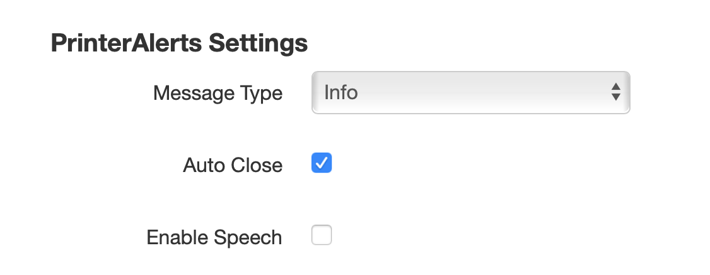

# OctoPrint-PrinterAlerts

Octoprint plugin to use OctoPrint's built in alerting system to notify users about "Printer Waiting for user" messages.

Note: this plugin might NOT work with files on the SD card. (Untested)

### Setup

Install via the bundled Plugin Manager or manually using this URL:

https://github.com/Patronics/OctoPrint-PrinterAlerts/archive/master.zip

### Changelog

* Version 0.7.0 In development as of 6/1/2019
   * Initial version modified from M117PopUp to PrinterAlerts. Implemented basic functionality

Thanks to jneilliii for the M117PopUp plugin this was heavily based on, you can access it at https://github.com/jneilliii/OctoPrint-M117PopUp/
